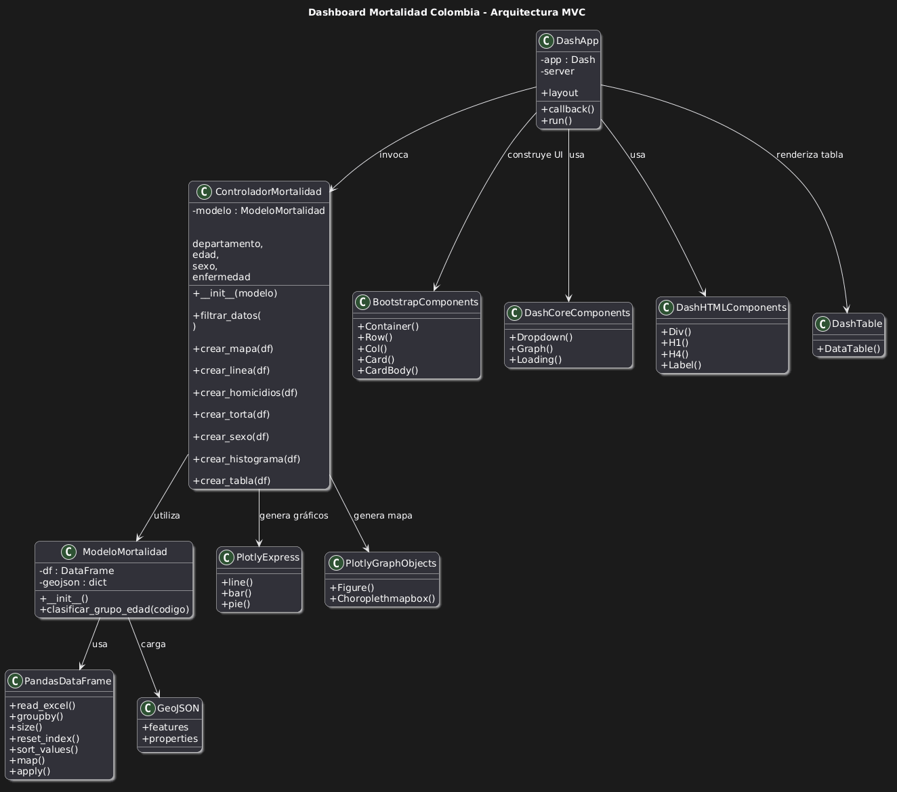
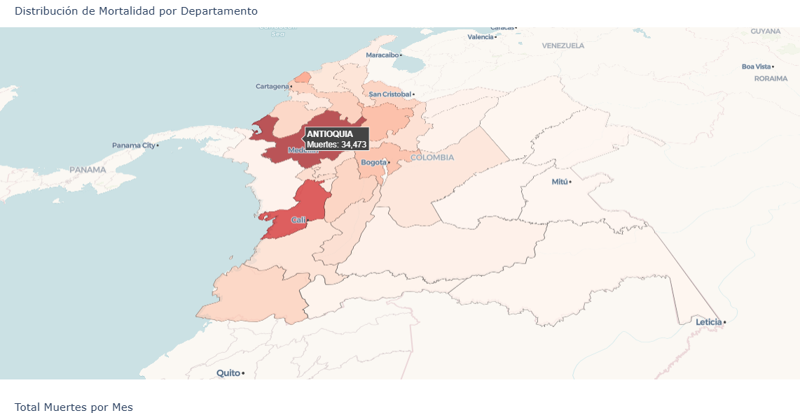
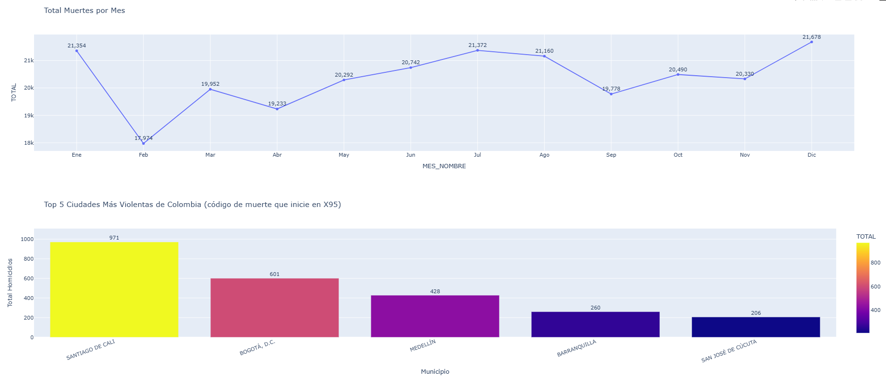
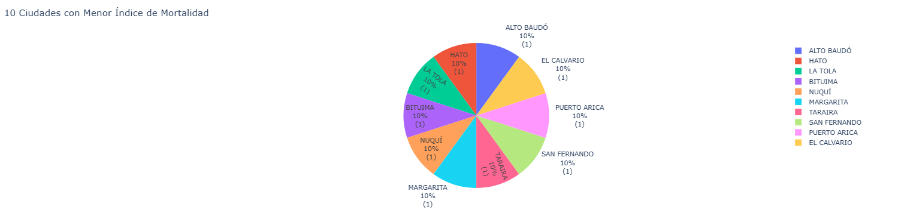

# 👨‍💻 Portada

| Nombre  de Estudiante: | Héctor Andrés Díaz Diazgranados|
|---|---|
| Materia: | Aplicaciones I |
| Programa: | Maestría en Inteligencia Artificial |
| Grupo: | Grupo I |
| Actividad: | Aplicación Web Interactiva |
| Unidad: | Unidad 2 |
| Profesor: | Cristian Duney Bérmudez Quintero |
| Fecha: | Mayo 11 de 2026 |

---


# 📊 Aplicación Web Interactiva para el Análisis de Mortalidad en Colombia

Aplicación web interactiva desarrollada con Python, Dash y Plotly para el análisis exploratorio de datos de mortalidad en Colombia mediante visualizaciones dinámicas, filtros interactivos y analítica visual avanzada.

---


---

# 📑 Tabla de Contenido

- [Introducción](#-introducción)
- [Objetivos](#-objetivos)
- [Características](#-características)
- [Arquitectura MVC](#-arquitectura-mvc)
- [Diseño Visual](#-diseño-visual)
- [Estructura del Proyecto](#-estructura-del-proyecto)
- [Tecnologías](#-tecnologías-utilizadas)
- [Requisitos](#-requisitos)
- [Instalación](#-instalación)
- [Ejecución](#-ejecución-local)
- [Despliegue Azure](#-despliegue-en-azure)
- [Visualizaciones](#-visualizaciones-implementadas)
- [Hallazgos](#-hallazgos-principales)
- [Capturas](#-capturas-de-pantalla)
- [Autor](#-autor)

---

# 📌 Introducción

El objetivo de esta actividad es desarrollar una aplicación web dinámica utilizando Plotly y Dash en el lenguaje de programación Python, considerando un caso de estudio orientado al análisis de mortalidad en Colombia para el año 2019.

La aplicación integra visualizaciones interactivas, filtros dinámicos y componentes analíticos que facilitan la interpretación de los datos, permitiendo una exploración visual intuitiva y procesamiento interactivo en tiempo real.

La solución fue desplegada en Azure App Service, garantizando accesibilidad web y compatibilidad cloud.

---

# 🎯 Objetivos

La aplicación busca:

✅ Identificar patrones de mortalidad por departamento y municipio.  
✅ Analizar mortalidad por sexo y grupo etario.  
✅ Explorar tendencias temporales mensuales.  
✅ Detectar enfermedades predominantes.  
✅ Implementar analítica visual interactiva.  
✅ Desarrollar un dashboard responsive basado en Dash.  

---

# 🚀 Características

- Dashboard interactivo.
- Arquitectura MVC.
- Filtros dinámicos.
- Visualización geográfica de Colombia.
- Componentes visuales Bootstrap.
- Diseño responsive tipo enterprise dashboard.
- Procesamiento de datos con Pandas.
- Visualizaciones interactivas con Plotly.
- Compatible con Azure App Service.
- Implementación cloud-ready.

---

# 🏗 Arquitectura MVC

La aplicación implementa el patrón Modelo Vista Controlador (MVC).

---

## 🚨 Diagrama de Clases

<p align="center">
  
</p>

<p align="center">
  <b>Figura 1.</b> Arquitectura MVC del Dashboard de Mortalidad.
</p>

---

## Modelo

Responsable de:

- Carga de datos.
- Limpieza de información.
- Clasificación de grupos de edad.
- Procesamiento estadístico.
- Lectura de GeoJSON.

---

## Controlador

Responsable de:

- Aplicación de filtros.
- Construcción de visualizaciones.
- Procesamiento analítico.
- Generación de tablas dinámicas.
- Manejo de callbacks analíticos.

---

## Vista

Responsable de:

- Interfaz gráfica.
- Layout responsive.
- Bootstrap Cards.
- Dropdowns interactivos.
- Dash callbacks.
- Renderización visual.

---

# 🎨 Diseño Visual

La aplicación implementa un diseño moderno tipo analytics dashboard utilizando:

- Dash Bootstrap Components.
- Layout responsive.
- Cards analíticas.
- Loading animations.
- Paneles interactivos.
- Diseño enterprise style.
- Visualizaciones centradas en experiencia de usuario.

---

# 📁 Estructura del Proyecto

```text
Proyecto/
│
├── app.py
├── data/
│   ├── Mortalidad2.xlsx
│   └── depts.json
├── screenshots/
│   ├── mapa.png
│   ├── modelo.png
│   ├── total_muertes.png
│   └── menor_mortalidad.png
├── requirements.txt
├── runtime.txt
├── deploy.sh
├── deploy.ps1
├── README.md
└── .deploymentignore
```

---

# 📂 Archivos Principales

| Archivo | Descripción |
|---|---|
| `app.py` | Aplicación principal Dash |
| `Mortalidad2.xlsx` | Dataset mortalidad |
| `depts.json` | GeoJSON departamentos Colombia |
| `requirements.txt` | Dependencias Python |
| `runtime.txt` | Runtime Python cloud |
| `deploy.sh` | Script despliegue Linux |
| `deploy.ps1` | Script despliegue Windows |
| `README.md` | Documentación proyecto |

---

# 🛠 Tecnologías Utilizadas

| Tecnología | Uso |
|---|---|
| Python | Backend |
| Dash | Dashboard |
| Plotly | Visualización |
| Pandas | Procesamiento datos |
| Dash Bootstrap Components | UI responsive |
| VS Code | Desarrollo |
| Git | Versionamiento |
| Azure App Service | Cloud deployment |
| GeoJSON | Mapas |

---

# ⚙ Requisitos

## Librerías principales

```text
Python 3.11
Dash
Dash Bootstrap Components
Plotly
Pandas
Openpyxl
Gunicorn
```

---

# 📦 requirements.txt

```text
dash==2.18.2
dash-bootstrap-components==1.6.0
plotly==5.24.1
pandas==2.2.3
numpy==2.1.2
openpyxl==3.1.5
gunicorn==23.0.0
```

---

# 💻 Instalación

## 1. Clonar repositorio

```bash
git clone https://github.com/hdiaz59/APPI-G1-ACT4.git
```

---

## 2. Ingresar carpeta

```bash
cd APPI-G1-ACT4
```

---

## 3. Crear entorno virtual

### Windows

```bash
python -m venv venv
```

### Linux / Mac

```bash
python3 -m venv venv
```

---

## 4. Activar entorno virtual

### Windows

```bash
venv\Scripts\activate
```

### Linux / Mac

```bash
source venv/bin/activate
```

---

## 5. Instalar dependencias

```bash
pip install -r requirements.txt
```

---

# ▶ Ejecución Local

```bash
python app.py
```

Abrir navegador:

```text
http://127.0.0.1:8050/
```

---

# ☁ Despliegue en Azure


---

# 📸 Capturas de Pantalla

<p align="center">
  
</p>

<p align="center">
  <b>Figura 2.</b> Configuración Microsoft Azure.
</p>


## Login Azure

```bash
az login
```

---

## Crear ZIP

```bash
Compress-Archive -Path * -DestinationPath deploy.zip -Force
```

---

## Deploy

```bash
az webapp deploy `
  --name happy-bay-08ca9780f98b4a62bffa48a5452f3317 `
  --resource-group hdiaz59_rg_2123 `
  --src-path deploy.zip `
  --type zip
```

---

## Reiniciar aplicación

```bash
az webapp restart `
  --resource-group hdiaz59_rg_2123 `
  --name happy-bay-08ca9780f98b4a62bffa48a5452f3317
```

---

# 📊 Visualizaciones Implementadas

## 🗺 Mapa Interactivo

Visualización de la distribución total de muertes por departamento en Colombia para el año 2019.

### Variables

- Departamento
- Total de muertes

---

## 📈 Gráfico de Líneas

Representación del total de muertes por mes en Colombia, mostrando variaciones a lo largo del año.

---

## 📊 Barras Homicidios

Visualización de las 5 ciudades más violentas de Colombia, considerando homicidios (códigos X95, agresión con disparo de armas de fuego y casos no especificados).

> Nota: Se modificó la agrupación para considerar todos los códigos que inician en X95.

---

## 🥧 Gráfico Circular

Muestra las 10 ciudades con menor índice de mortalidad.

> Nota: Debido a que existen múltiples ciudades con una única muerte, las ciudades pueden variar dependiendo de la agrupación utilizada.

---

## 👥 Barras Apiladas por Sexo

Comparación del total de muertes por sexo en cada departamento, permitiendo analizar diferencias significativas entre géneros.

---

## 📉 Histograma Grupos Etarios

Distribución de mortalidad por grupos de edad definidos mediante la variable GRUPO_EDAD1.

---

## 📋 Tabla Principales Causas

Listado de las 10 principales causas de muerte en Colombia, incluyendo:

- Código
- Nombre enfermedad
- Total casos

---

# 🔍 Hallazgos Principales

- Concentración de mortalidad en regiones urbanas.
- Diferencias relevantes por sexo.
- Mayor mortalidad en adultos mayores.
- Variaciones regionales significativas.
- Identificación de enfermedades predominantes.
- Patrones geográficos diferenciados.

---

# 📸 Capturas de Pantalla

## 🗺 Mapa Interactivo

<p align="center">
  
</p>

<p align="center">
  <b>Figura 2.</b> Distribución geográfica de mortalidad.
</p>

---

## 📈 Total Muertes y Ciudades Violentas

<p align="center">
  
</p>

<p align="center">
  <b>Figura 3.</b> Tendencia mensual y homicidios.
</p>

---

## 🥧 Menor Índice Mortalidad

<p align="center">
  
</p>

<p align="center">
  <b>Figura 4.</b> Municipios con menor mortalidad.
</p>


# ☁ Despliegue Cloud

La aplicación fue desplegada utilizando:

- Azure App Service
- Azure CLI
- GitHub
- Python 3.11
- Linux Runtime

---

# 📄 Licencia

Proyecto académico y educativo.